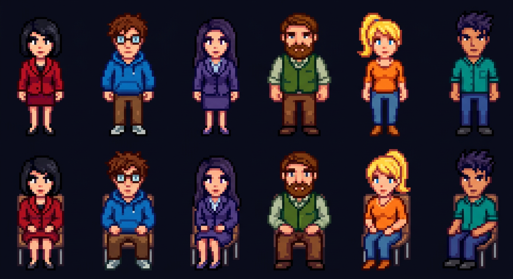

# 🎙️ Roundtable v2

**Structured multi-agent research discussion with independent reasoning, visual game view, and AI-generated pixel art characters.**

Roundtable creates a panel of AI agents with distinct personalities, has them debate a topic across structured sub-topics, and produces a synthesized research report. Each agent reasons privately before speaking publicly, creating more authentic disagreement and deeper analysis.



## Features

- **Independent Agent Reasoning** — Each agent privately analyzes the discussion before crafting their public response. Reasoning is visible via collapsible panels in the UI.
- **Context Isolation** — Agents only see public statements + their own private reasoning. No agent can see another's system prompt or internal thoughts.
- **Structured Discussion Flow** — Topics are broken into 3-6 sub-topics. Each sub-topic goes through rounds of agent discussion → critic review → targeted corrections → planner review.
- **Sharp Critic** — A dedicated critic agent catches echo chambers, empty claims, and vague conclusions. Targets specific agents with specific requests.
- **Stardew Valley Game View** — Pixel art characters sit around a roundtable, stand up to speak, and the critic waves flags (green = approved, red = issues). Powered by Phaser 3.
- **Real-time Streaming** — All agent responses stream via SSE. Watch the discussion unfold word by word.
- **Pause & Inject** — Pause the discussion anytime to add your own thoughts. Agents will factor them in.
- **Multi-model Support** — Works with OpenAI, Anthropic (Claude), and any OpenAI-compatible API. Auto-detects API format based on model name.
- **Export** — Export the full discussion + final synthesis as Markdown.

## Quick Start

```bash
# Install
npm install

# Configure
cp .env.example .env
# Edit .env — see Configuration below

# Build & run
npx tsc
node dist/index.js

# Or dev mode (auto-reload)
npm run dev
```

Open **http://localhost:3210**

## Configuration

```env
# LLM provider (auto-detects OpenAI vs Anthropic format)
LLM_BASE_URL=http://localhost:3031    # API base URL (no /v1 suffix)
LLM_API_KEY=your-api-key
LLM_MODEL=claude-opus-4-6            # or gpt-4o, gpt-4.1, etc.

# Server
PORT=3210
```

| Variable | Description | Default |
|----------|-------------|---------|
| `LLM_BASE_URL` | API base URL | `https://api.openai.com/v1` |
| `LLM_API_KEY` | API key | — |
| `LLM_MODEL` | Model name. Claude models auto-use Anthropic Messages API | `gpt-4o` |
| `PORT` | Server port | `3210` |

## How It Works

### Discussion Flow

```
1. User enters topic + optional panel preferences
2. Planner generates discussion plan:
   - 3-6 sub-topics (foundational → synthesis → actionable)
   - 3-5 agents with distinct perspectives & speaking styles
   - Built-in tensions between agents
3. For each sub-topic:
   a. Planner introduces the sub-topic with framing questions
   b. Each agent:
      i.  Privately reasons (analyzes discussion, plans position)
      ii. Publicly speaks (informed by private reasoning)
   c. Critic reviews the round:
      - Catches echo chambers, empty claims, vague conclusions
      - Targets specific agents to fix specific issues
   d. Targeted agents respond to critique (with private reasoning)
   e. Planner reviews completion and summarizes
4. Final synthesis report across all sub-topics
5. Conflict check for contradictions
```

### Agent Architecture

```
┌─────────────────────────────────────────┐
│              Same LLM Model             │
│         (e.g. Claude Opus 4.6)          │
└─────────┬───────────┬───────────┬───────┘
          │           │           │
    ┌─────▼─────┐ ┌───▼───┐ ┌────▼────┐
    │  Agent A  │ │Agent B│ │ Agent C │   Different system prompts
    │  (private │ │       │ │         │   + speaking styles
    │ reasoning)│ │       │ │         │   + context isolation
    └───────────┘ └───────┘ └─────────┘

Context each agent sees:
  ✅ Own system prompt (role, perspective, speaking style)
  ✅ All public statements from all agents
  ✅ Own previous private reasoning
  ❌ Other agents' system prompts
  ❌ Other agents' private reasoning
```

### Key Design Decisions

- **speakingStyle field** — Each agent gets a unique communication style ("blunt and data-driven", "thinks in analogies", "loves poking holes"). Prevents the "everyone sounds the same" problem.
- **Mandatory disagreement** — Agent prompts explicitly prohibit "感谢XX" openers and require agents to challenge ideas they disagree with.
- **Per-turn targeted prompts** — Instead of generic "continue the discussion", each agent gets a prompt referencing the last few speakers' specific points.
- **Streaming-first LLM calls** — Even "non-streaming" calls (reasoning, planning) use streaming internally via AI SDK to avoid proxy timeouts with slow models.

## Project Structure

```
roundtable/
├── src/
│   ├── index.ts          # Express server, SSE, discussion loop
│   ├── llm.ts            # AI SDK wrapper (OpenAI + Anthropic)
│   ├── types.ts          # TypeScript interfaces
│   ├── planner.ts        # Plan generation, sub-topic intro/review, synthesis
│   ├── agents.ts         # Agent reasoning + public response generation
│   └── critic.ts         # Discussion quality critic
├── public/
│   ├── index.html        # Main page layout
│   ├── app.js            # Frontend logic, SSE handling, UI updates
│   ├── game.js           # Phaser 3 game scene (roundtable visualization)
│   ├── style.css         # Dark theme styles
│   └── sprites/          # Stardew Valley-style pixel art
│       ├── agent-stand-{0-5}.png   # 6 standing agent sprites
│       ├── agent-sit-{0-5}.png     # 6 sitting agent sprites
│       ├── host.png                # Moderator/host character
│       ├── critic.png              # Critic standing pose
│       ├── critic-flag-green.png   # Critic waving green flag (approved)
│       ├── critic-flag-red.png     # Critic waving red flag (issues)
│       └── table.png               # Round conference table
├── .env                  # LLM configuration
├── tsconfig.json
└── package.json
```

## Game View

The game view (`?preview` for mock data) uses **Phaser 3** to render a pixel art roundtable scene:

- Characters sit around a wooden table
- The current speaker stands up with a breathing animation
- Thinking agents show animated dots above their head
- Speech bubbles appear with agent-colored borders
- The critic switches to flag-waving sprites during review
- A blackboard shows the current sub-topic
- Host and Critic flank the scene on either side

Sprites are AI-generated using **Gemini Flash Image** model in Stardew Valley pixel art style, with consistency maintained by passing previous sprites as reference images.

## API Endpoints

| Method | Path | Description |
|--------|------|-------------|
| `POST` | `/api/session` | Create session with topic |
| `GET` | `/api/session/:id` | Get session state |
| `GET` | `/api/session/:id/stream` | SSE event stream |
| `POST` | `/api/session/:id/start` | Start discussion |
| `POST` | `/api/session/:id/pause` | Pause discussion |
| `POST` | `/api/session/:id/resume` | Resume discussion |
| `POST` | `/api/session/:id/inject` | Inject user message |

### SSE Events

| Event | Data | Description |
|-------|------|-------------|
| `init` | session state | Initial state on connect |
| `message` | complete message | Non-streamed message |
| `message_start` | metadata | Start of streamed message |
| `message_chunk` | `{id, chunk}` | Text chunk |
| `message_end` | `{id}` | End of streamed message |
| `thinking` | `{agentId, agentName}` | Agent reasoning privately |
| `reasoning` | `{agentId, reasoning, color}` | Private reasoning content |
| `speaking` | `{agentId, agentName}` | Agent speaking publicly |
| `subtopic_start` | `{index, subTopic}` | New sub-topic beginning |
| `subtopic_complete` | `{index, subTopic}` | Sub-topic finished |
| `status` | `{status}` | Session status change |

## Tech Stack

- **Backend**: Node.js + Express + TypeScript
- **Frontend**: Vanilla JS + CSS (no framework)
- **Game**: Phaser 3 (pixel art scene)
- **LLM**: Vercel AI SDK (`ai` + `@ai-sdk/openai` + `@ai-sdk/anthropic`)
- **Streaming**: Server-Sent Events (SSE)

## License

MIT
